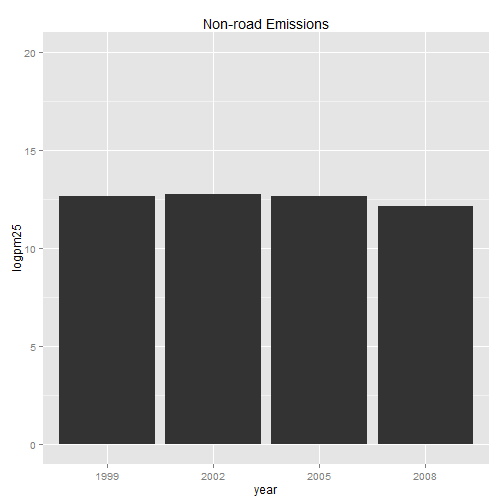

## Introduction

-For the final project, I employed a emission data available from National Emissions Inventory (NEI), 
"http://d396qusza40orc.cloudfront.net/exdata%2Fdata%2FNEI_data.zip". The NEI emissions is compiled by the  Environmental Protection Agency (EPA) with the aim to track emission in the atmosphere.

-In this analysis we focus in the visual analsys of emission of four type of vehicles (Non-road, Nonpoint,  On-road, and Point) in four years (1999, 2002, 2005, and 2008).

--- .class #id

## Summary data
This is summary the information of the data we use.


```
##    year         type        pm25            logpm25    
##  1999:4   Non-road:4   Min.   : 107384   Min.   :11.6  
##  2002:4   Nonpoint:4   1st Qu.: 183838   1st Qu.:12.1  
##  2005:4   On-road :4   Median : 539188   Median :13.1  
##  2008:4   Point   :4   Mean   :1367979   Mean   :13.3  
##                        3rd Qu.:1602537   3rd Qu.:14.2  
##                        Max.   :5518185   Max.   :15.5
```

--- .class #id

## Example

The shiny app produces a chart bar for each of the four vehicles. Example:

 

--- .class #id

## Github Repository

More details of this shinny app can be found at

https://github.com/yry12/devdataproducts

Slidify

https://github.com/yry12/devdataproduct_slidify

